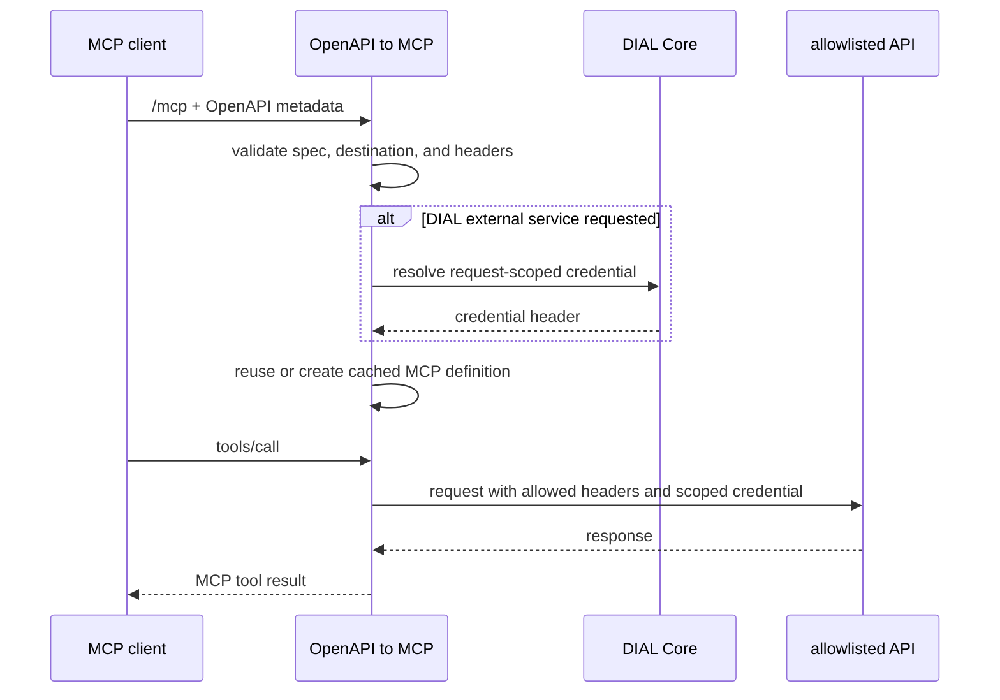

# Architecture

OpenAPI to MCP is a streamable-HTTP MCP server that creates a tool surface from request metadata.

## Trust boundaries

- MCP metadata, OpenAPI documents, tool arguments, destinations, and forwarded headers are untrusted input.
- Operators configure the host and forwarded-header allowlists.
- DIAL credentials are resolved per request and injected only into the outbound request context.
- Cache entries own generated MCP definitions and HTTP clients, but do not own request credentials.
- The process must be deployed behind authenticated ingress; the bridge does not authenticate clients itself.
